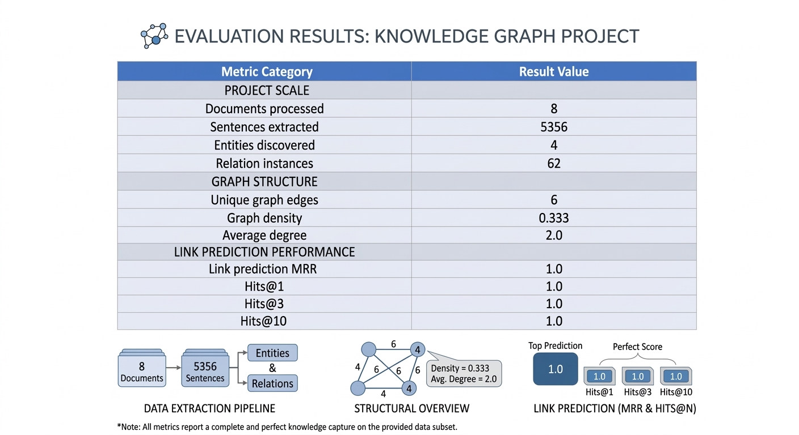
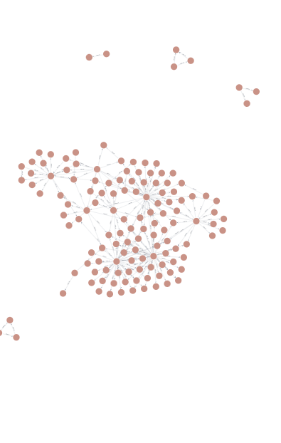
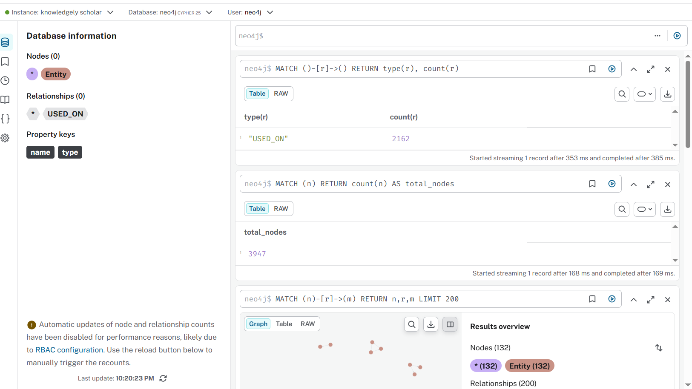

9# Scholarly Knowledge Graph Construction

An end-to-end research engineering pipeline for constructing a knowledge graph from scholarly research papers.

This project implements a modular machine learning pipeline that processes academic PDF documents, extracts important entities such as research tasks and datasets, identifies relationships between them, and constructs a structured knowledge graph stored in Neo4j.

The system demonstrates how modern natural language processing models, graph representation learning, and graph databases can be combined into a complete ML pipeline that transforms unstructured scientific literature into structured knowledge.

The project is designed as a **reproducible research engineering framework**, allowing experimentation with different NER models, relation extraction strategies, graph embeddings, and graph analytics techniques.

# Motivation

Scientific knowledge is primarily distributed through research papers. Extracting useful information from these documents typically requires manually reading large volumes of text and identifying relationships between concepts such as methods, datasets, and experimental tasks.

This project explores how machine learning pipelines can automate part of this process by converting research papers into a structured knowledge graph that can be queried and analyzed.

The pipeline demonstrates how transformer-based NLP models, entity normalization, relation extraction, and graph learning techniques can work together to construct structured representations of scientific knowledge.

# System Architecture

The system integrates multiple components including document ingestion, NLP processing, entity extraction, relation discovery, graph construction, graph embedding generation, and graph database storage.

# Pipeline Workflow

The pipeline processes scholarly documents through the following stages:

Document ingestion from PDF files
Text preprocessing and cleaning
Sentence segmentation
Named Entity Recognition (NER)
Entity normalization
Relation extraction
Graph construction
Graph embeddings using Node2Vec
Graph storage in Neo4j
Graph analytics and evaluation

The architecture separates data ingestion, NLP modeling, graph construction, graph representation learning, and evaluation, allowing each component to evolve independently.

# Example Knowledge Graph

The generated knowledge graph shows clusters of related entities extracted from the research papers.

Nodes represent entities discovered in the literature while edges represent relationships identified between those entities based on textual context.

# Neo4j Graph Exploration

The knowledge graph is stored inside Neo4j which enables interactive querying and visualization of relationships between extracted entities.

Example queries used to explore the graph include:

MATCH (n) RETURN count(n)

MATCH ()-[r]->() RETURN type(r), count(r)

MATCH (n)-[r]->(m) RETURN n,r,m LIMIT 200

# Example Evaluation Results

Example metrics produced by the pipeline include graph statistics and link prediction evaluation scores.

Graph statistics provide structural insights into the generated knowledge graph such as number of entities, number of relationships, graph density, and node connectivity.

Link prediction metrics evaluate how well graph embeddings capture structural relationships within the graph.

# Key Engineering Features

Modular ML Architecture

The pipeline is designed using modular components where NLP models can be swapped through configuration.

Supported NER backends include:

Rule-based extractor
BiLSTM-CRF model
Transformer-based model (SciBERT)

This allows researchers to experiment with different NLP models without modifying the core pipeline logic.

Relation Extraction Backend Architecture

Relation extraction follows a backend factory pattern that allows switching between multiple extraction strategies through configuration.

Supported approaches include heuristic rule-based extraction and transformer-based relation classification.

Graph Embeddings

The system generates node embeddings using the Node2Vec algorithm.

Graph embeddings capture structural relationships between entities in the knowledge graph and enable downstream machine learning tasks such as link prediction, clustering, and similarity search.

Embeddings are computed using the NetworkX and Node2Vec framework.

Configuration-Driven Pipeline

Pipeline behavior is controlled using configuration files.

configs/pipeline.yaml

This allows switching models, datasets, and infrastructure settings without modifying source code.

Experiment Caching

NER results are cached to accelerate repeated experiments.

cache/ner_mentions.json

Caching significantly reduces runtime during iterative development.

Secure Credential Handling

Database credentials are never stored in the repository.

Neo4j authentication uses environment variables:

export NEO4J_PASSWORD="your_password"

Pipeline Observability

The system includes structured logging and stage timing metrics which provide visibility into each stage of the pipeline.

Example pipeline log output includes:

Stage 1 — Loading documents

Stage 2 — Preprocessing PDFs

Stage 3 — Sentence splitting

Stage 4 — Entity extraction

Stage 5 — Entity normalization

Stage 6 — Relation extraction

Stage 7 — Graph construction

Stage 8 — Graph embeddings

Stage 9 — Neo4j graph write

Stage 10 — Graph statistics

Stage 11 — Link prediction evaluation

# Dataset

The dataset consists of research papers collected from arXiv and stored locally as PDF documents.

The pipeline processes these documents to extract entities and relationships that appear within the scientific literature.

The system can be extended to process larger research corpora by adding additional PDF documents to the dataset directory.

# Installation

Clone the repository:

git clone [https://github.com/](https://github.com/)<username>/scholarly-knowledge-graph.git

cd scholarly-knowledge-graph

Install dependencies:

pip install -r requirements.txt

# Running the Pipeline

Place research paper PDFs in:

data/raw_pdfs/

Set the Neo4j password:

export NEO4J_PASSWORD="your_password"

Run the pipeline:

PYTHONPATH=. python scripts/run_pipeline.py

The pipeline will process research papers, extract entities and relationships, construct the knowledge graph, generate graph embeddings, store the graph in Neo4j, compute graph statistics, and evaluate link prediction metrics.

# Technologies Used

Python
PyTorch
HuggingFace Transformers
SciBERT
Neo4j Graph Database
PDFPlumber
Scikit-learn
NetworkX
Node2Vec
spaCy
NLTK

# Limitations

Relation extraction currently relies primarily on heuristic methods rather than fully supervised relation extraction models.

The dataset size used for demonstration is relatively small, and larger datasets would produce richer knowledge graphs.

The transformer NER model has not been fine-tuned specifically for the target domain.

# Future Work

Possible future extensions include:

Training domain-specific NER models
Transformer-based relation extraction models
Graph neural networks for link prediction
Scaling the system to thousands of research papers
Graph-RAG integration with LLM systems
Interactive knowledge graph visualization dashboards

# License

This project is provided for research and educational purposes.
