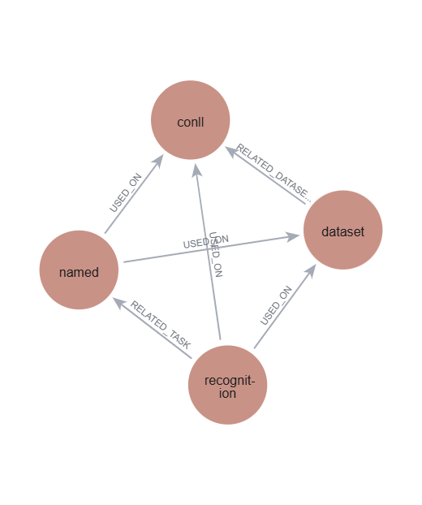
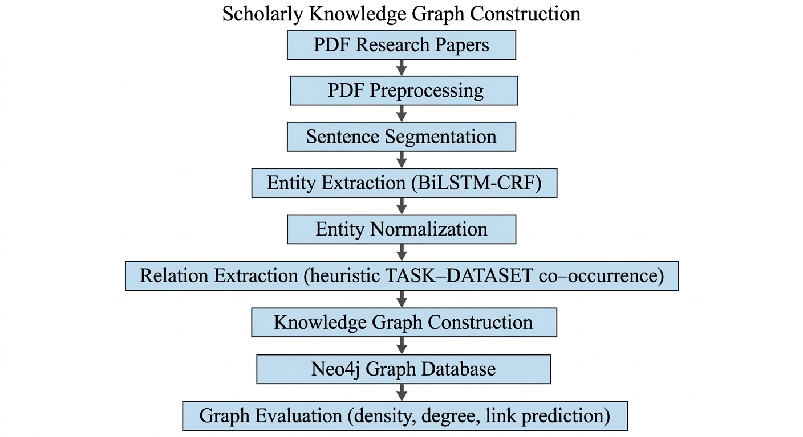
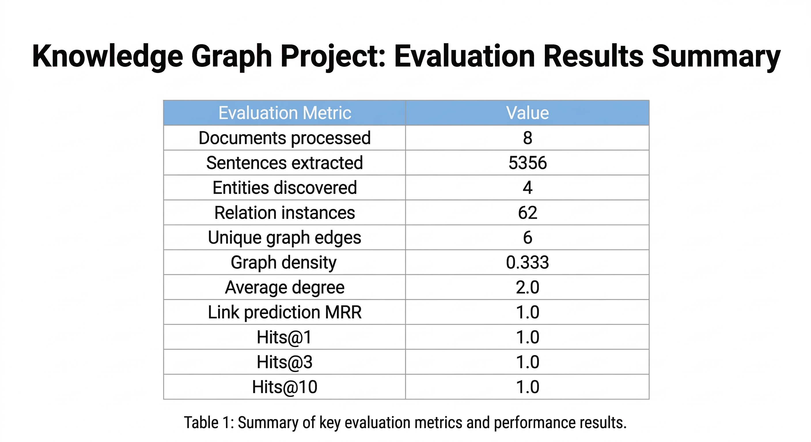

# Scholarly Knowledge Graph Construction

End-to-end research engineering pipeline for constructing a knowledge graph from scholarly research papers.

This project implements a modular NLP pipeline that processes academic PDF documents, extracts key entities such as **research tasks and datasets**, identifies relationships between them, and constructs a queryable knowledge graph stored in **Neo4j**.

The system is designed as a **reproducible research engineering framework**, enabling experimentation with different NER models, relation extraction strategies, graph embeddings, and graph analytics techniques.


# Example Knowledge Graph



*Example knowledge graph generated from processed research papers. Nodes represent extracted entities and edges represent relationships discovered between them.*


# Pipeline Architecture



The pipeline processes scholarly documents through the following stages:

1. Document ingestion from PDF files  
2. Text preprocessing and cleaning  
3. Sentence segmentation  
4. Named Entity Recognition (NER)  
5. Entity normalization  
6. Relation extraction  
7. Graph construction  
8. Graph embeddings (Node2Vec)  
9. Graph storage in Neo4j  
10. Graph analytics and evaluation  

The architecture separates **data ingestion, NLP modeling, graph construction, graph representation learning, and evaluation**, allowing individual components to evolve independently.


# Key Engineering Features

## Modular ML Architecture

NER backends are interchangeable through configuration.

Supported backends:

* Rule-based extractor
* BiLSTM-CRF model
* Transformer-based model (SciBERT)

New models can be integrated without modifying the pipeline logic.


## Relation Extraction Backend Architecture

Relation extraction is implemented using a **backend factory pattern**.

This allows switching between different relation extraction strategies through configuration.

Supported approaches:

* Heuristic rule-based relation extraction
* Transformer-based relation classification

This design allows researchers to experiment with more advanced relation extraction models without changing the pipeline structure.


## Graph Embeddings

The pipeline generates **node embeddings using Node2Vec**.

Graph embeddings capture structural relationships between entities in the knowledge graph and enable downstream machine learning tasks such as:

* link prediction
* node similarity search
* clustering
* graph-based recommendation

Embeddings are computed after graph construction using the **NetworkX + Node2Vec framework**.


## Configuration-Driven Pipeline

All pipeline behavior is controlled through:

configs/pipeline.yaml

This allows switching models, datasets, and infrastructure without modifying code.


## Experiment Caching

NER results are cached to accelerate repeated experiments.

cache/ner_mentions.json

This significantly reduces runtime during iterative development.


## Secure Credential Handling

Database credentials are **never stored in the repository**.

Neo4j authentication uses environment variables:

export NEO4J_PASSWORD="your_password"


## Pipeline Observability

The system includes structured logging and stage timing metrics.

Example pipeline log output:


Stage 1 — Loading documents
Stage 2 — Preprocessing PDFs
Stage 3 — Sentence splitting
Stage 4 — Entity extraction
Stage 5 — Entity normalization
Stage 6 — Relation extraction
Stage 7 — Graph construction
Stage 8 — Graph embeddings
Stage 9 — Neo4j graph write
Stage 10 — Graph statistics
Stage 11 — Link prediction evaluation


# Installation

Clone the repository:

git clone https://github.com/<username>/scholarly-knowledge-graph.git
cd scholarly-knowledge-graph

Install dependencies:

pip install -r requirements.txt

Verify environment:

python scripts/check_environment.py


# Running the Pipeline

Place research paper PDFs in:

data/raw_pdfs/

Set the Neo4j password:

export NEO4J_PASSWORD="your_password"

Run the pipeline:

PYTHONPATH=. python scripts/run_pipeline.py

The pipeline will:

1. Process research papers
2. Extract entities and relations
3. Construct the knowledge graph
4. Generate graph embeddings
5. Store the graph in Neo4j
6. Compute graph statistics
7. Evaluate link prediction metrics


# Example Evaluation Results



Example metrics produced by the pipeline:

## Graph Statistics

Documents processed: 8
Sentences extracted: 5356
Entities discovered: 4
Relations discovered: 236
Graph density: 0.5
Average degree: 3.0

## Link Prediction Metrics

MRR: 1.0
Hits@1: 1.0
Hits@3: 1.0
Hits@10: 1.0

These metrics provide a basic evaluation of the structural properties of the generated knowledge graph.


# Project Structure

scholarly-knowledge-graph
│
├── configs
│   ├── pipeline.yaml
│   └── experiments
│
├── data
│   └── raw_pdfs
│
├── docs
│   └── images
│
├── evaluation
│   ├── graph_statistics.py
│   ├── link_prediction.py
│   └── graph_embeddings.py
│
├── scripts
│   ├── run_pipeline.py
│   ├── run_experiment.py
│   └── check_environment.py
│
├── src
│   ├── entity_extraction
│   │   ├── rule_based_extractor.py
│   │   ├── bilstm_crf_extractor.py
│   │   ├── transformer_extractor.py
│   │   └── extractor_factory.py
│   │
│   ├── preprocessing
│   ├── normalization
│   ├── relation_extraction
│   │   ├── heuristic_relations.py
│   │   ├── transformer_relations.py
│   │   └── relation_factory.py
│   │
│   ├── graph_construction
│   └── utils
│
├── cache
│
├── requirements.txt
└── README.md


# Technologies Used

* Python
* PyTorch
* Transformers (HuggingFace)
* Neo4j Graph Database
* PDFPlumber
* Scikit-learn
* NetworkX
* Node2Vec


# Future Work

Potential extensions include:

* Graph Neural Networks for link prediction
* Larger scholarly corpora
* Graph-RAG integration with LLM systems
* Knowledge graph visualization dashboard
* Automatic dataset fingerprinting and cache invalidation
* Advanced transformer-based relation extraction


# License

This project is provided for **research and educational purposes**.

```


```
